🍽️ Plateful - Meal Planner App

A comprehensive meal planning application built with Flutter that helps users discover, save, and organize their favorite meals. Plateful combines an intuitive UI with powerful features to make meal planning effortless and enjoyable.

## 📱 Screenshots

  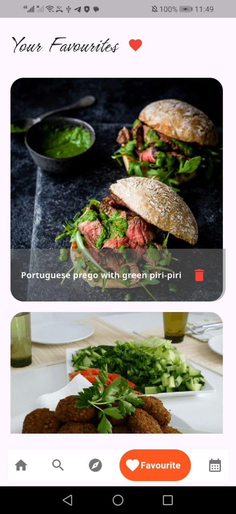
  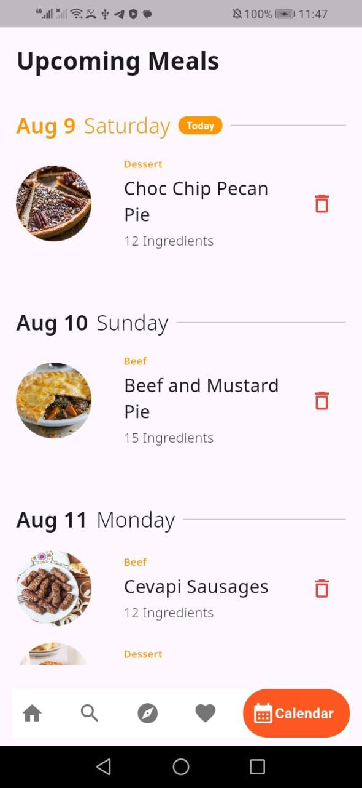
  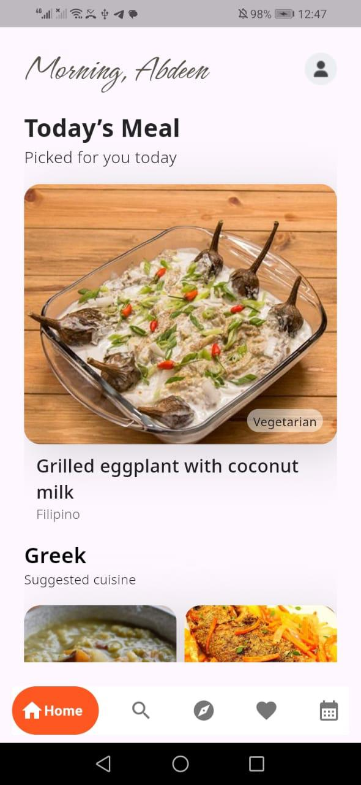
  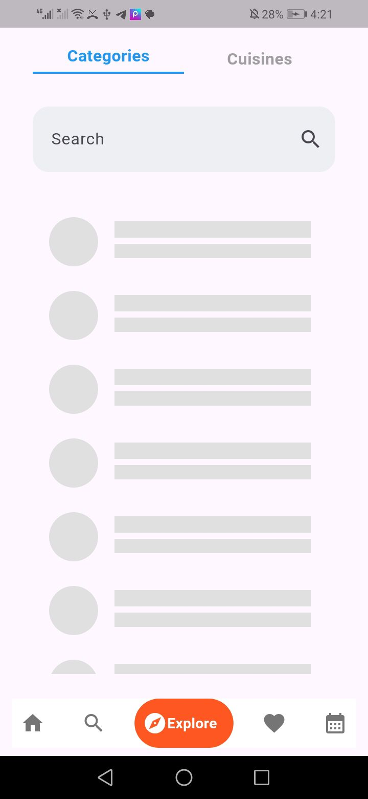
  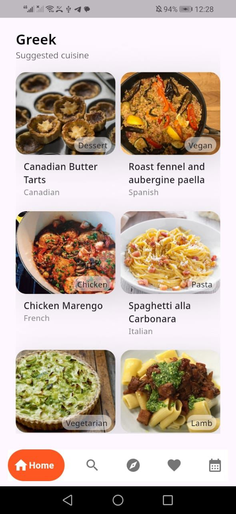
  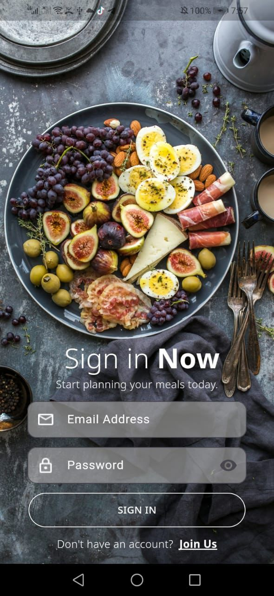
  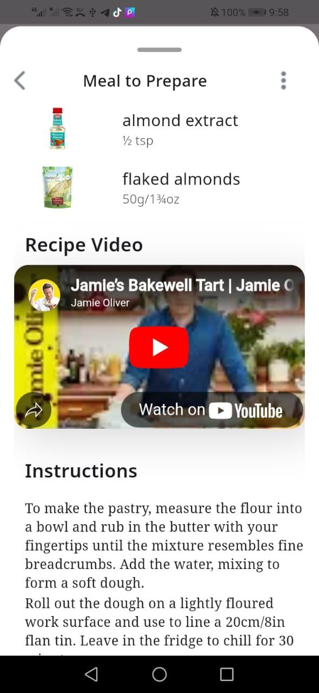
  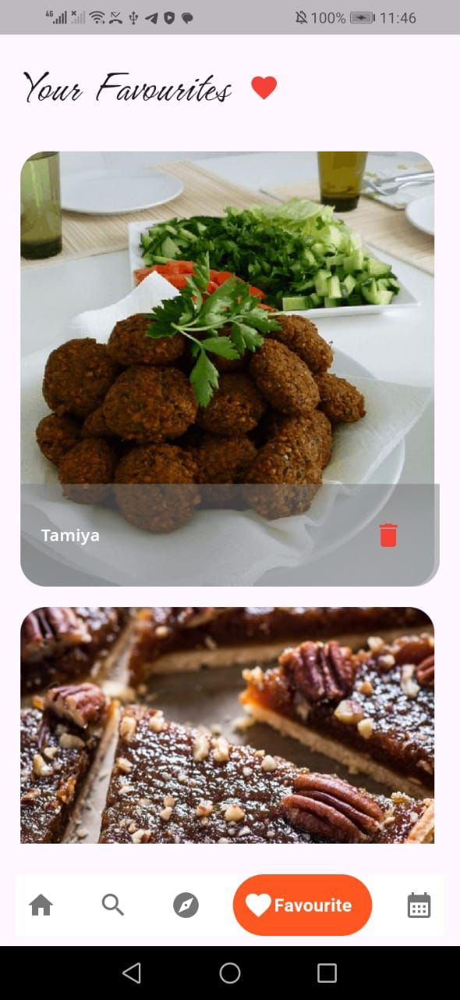
  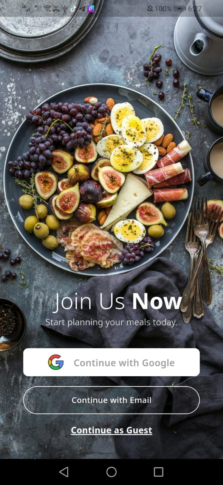
  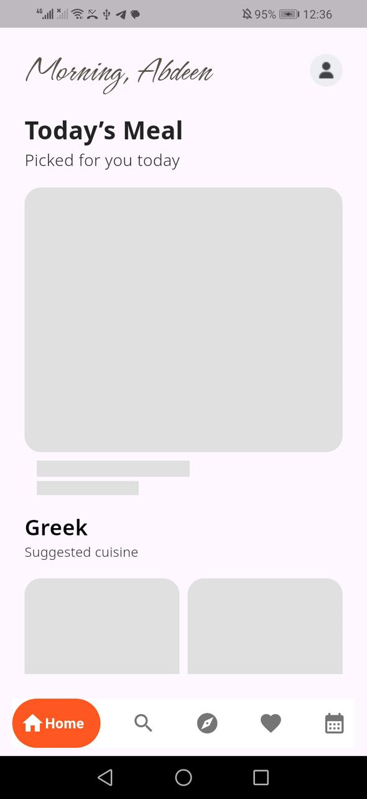
  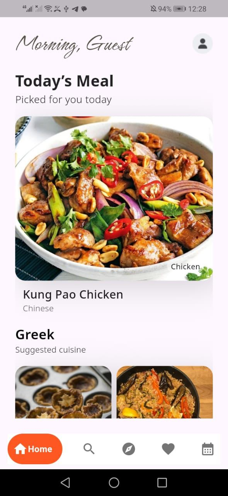
  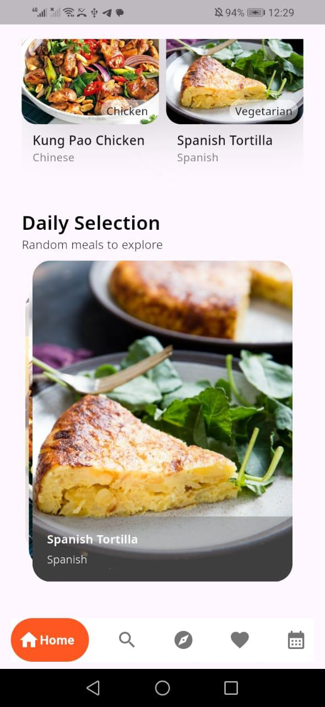
  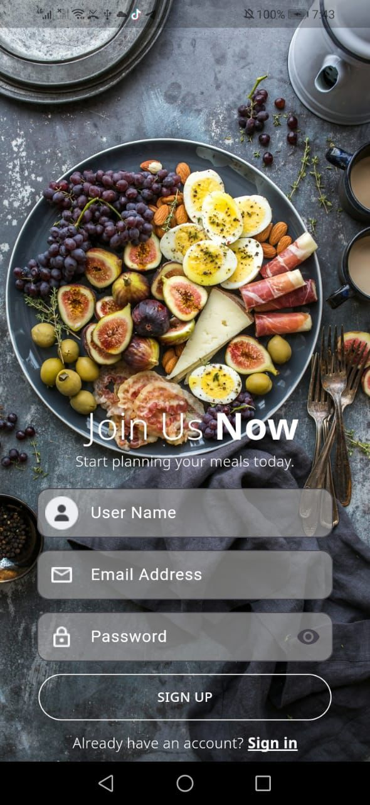
  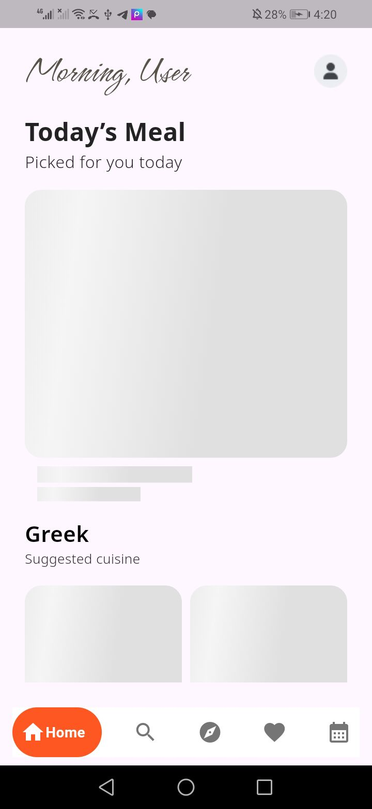
  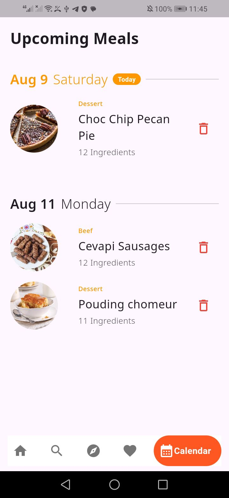
  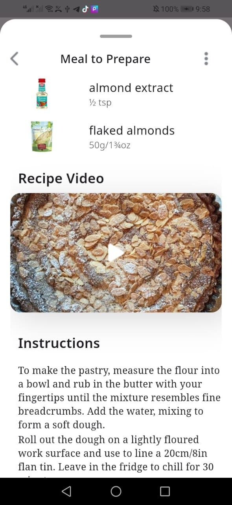
  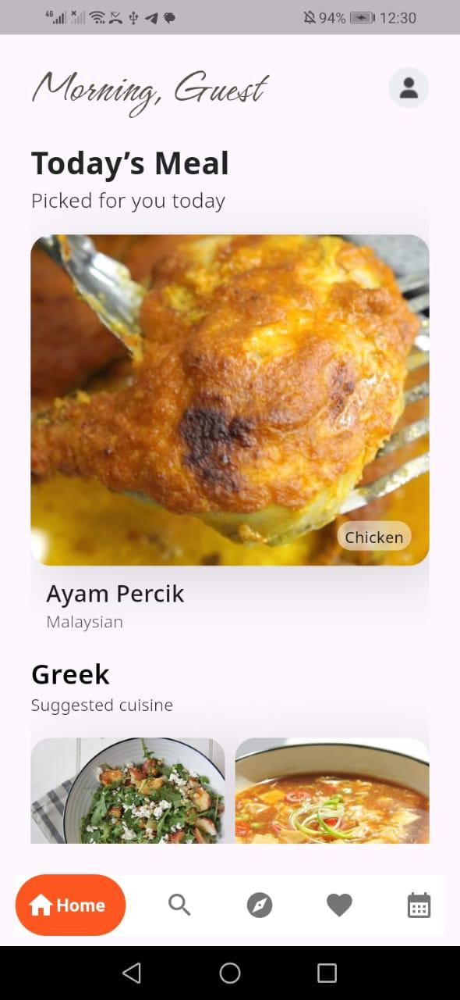
  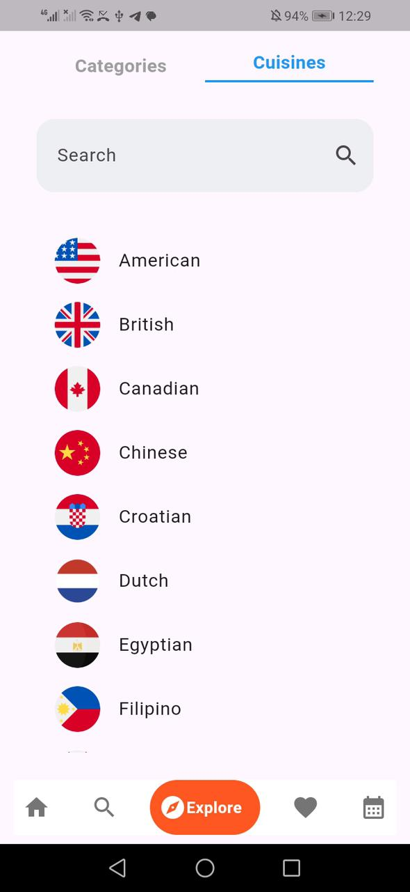
  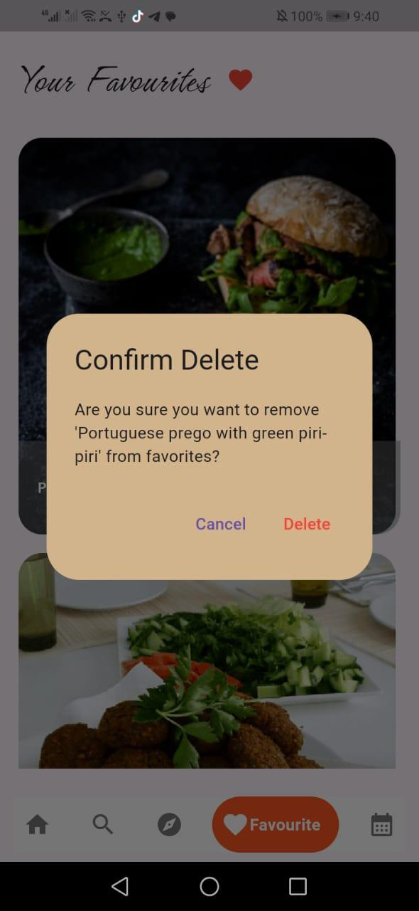
  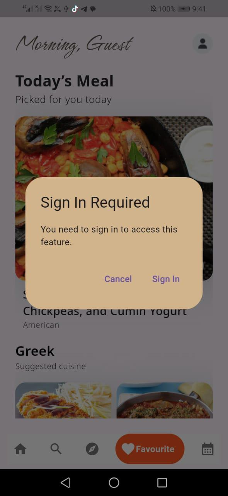

✨ Features

🏠 Home

Personalized Meal Recommendations: Daily meal suggestions tailored for you
Interactive Card Swiper: Swipe through random meals to discover new recipes
Categorized Meal Display: Browse meals by categories and cuisines
Smart Caching: Offline access to previously viewed meals
Pull to Refresh: Get fresh meal recommendations anytime

🔍 Search

Advanced Search: Find meals by name, category, area, or ingredients
Recent Searches: Quick access to your search history (stored locally)
Popular Searches: Discover trending meal searches
Real-time Results: Instant search results as you type
Smart Filtering: Filter results by multiple criteria

🌍 Explore

Browse by Category: 14 meal categories (Beef, Chicken, Dessert, Seafood, etc.)
Browse by Cuisine: 29 international cuisines (Italian, Mexican, Chinese, etc.)
Visual Discovery: Beautiful imagery for each category and cuisine
Filter Results: View all meals within selected categories or areas
Detailed Meal Information: Complete meal details with one tap

❤️ Favorites

Save Your Favorites: Bookmark meals you love
Quick Access: Easy management of saved meals
Persistent Storage: Favorites stored locally with Hive
Delete with Confirmation: Prevent accidental deletions
User Authentication Required: Sign in to access favorites

📅 Calendar

Meal Scheduling: Plan meals for specific dates
Visual Calendar Interface: Date picker for easy meal planning
Meal Organization: View meals grouped by date
Today's Indicator: Quickly identify today's planned meals
Edit & Delete: Manage scheduled meals with ease
User Authentication Required: Sign in to access calendar

🔐 Authentication

Email & Password Sign Up/In: Traditional authentication method
Google Sign-In: Quick authentication with Google account
Guest Mode: Browse app features without signing in (limited functionality)
Firebase Integration: Secure user data management
Profile Management: View and update user profile
Profile Picture: Upload and store profile images in Firestore
Persistent Sessions: Stay logged in across app restarts

📖 Meal Details

Comprehensive Information:

Full ingredient list with measurements
Step-by-step cooking instructions
Category and area classification
High-quality meal images

Embedded Video Tutorial: YouTube recipe videos
Quick Actions:

Add to Favorites
Schedule to Calendar
Share meal details

Ingredient Counter: See total ingredient count at a glance

🎨 UI/UX Features

Beautiful Animations: Smooth transitions and loading states
Shimmer Effects: Elegant loading placeholders
Bottom Navigation: Easy navigation between main features
Material Design: Clean and modern interface
Custom App Bar: Personalized greeting with profile picture
Responsive Design: Optimized for different screen sizes
Error Handling: User-friendly error messages
Offline Support: Cached data available without internet

🏗️ Architecture

The app follows Clean Architecture principles with clear separation of concerns 
Each feature follows a layered architecture:

Presentation Layer: Widgets, ViewModels (Cubits), States    
Domain Layer: Use Cases, Repositories (Interfaces)
Data Layer: Repository Implementations, Data Sources (Remote/Local), Models

🛠️ Tech Stack
Core

Flutter SDK: Cross-platform mobile framework
Dart: Programming language                              

State Management

flutter_bloc (^8.1.6): BLoC pattern implementation
equatable (^2.0.5): Value equality for states

Navigation

go_router (^14.6.2): Declarative routing

Networking

dio (^5.7.0): HTTP client for API calls
connectivity_plus (^6.1.1): Network connectivity monitoring

Local Storage

hive (^2.2.3) & hive_flutter (^1.1.0): Lightweight NoSQL database
shared_preferences (^2.3.3): Simple key-value storage

Firebase

firebase_core (^3.8.1): Firebase initialization

firebase_auth (^5.3.4): User authentication

cloud_firestore (^5.5.2): Cloud database for user data

google_sign_in (^6.2.2): Google authentication

UI Components

card_swiper (^3.0.1): Swipeable card interface

google_nav_bar (^5.0.6): Bottom navigation bar

shimmer (^3.0.0): Loading skeleton screens

cached_network_image (^3.4.1): Image caching

webview_flutter (^4.10.0): Embedded web content

Media & Files

image_picker (^1.1.2): Pick images from gallery/camera

flutter_image_compress (^2.3.0): Image compression

Utilities

intl (^0.19.0): Internationalization and formatting

dartz (^0.10.1): Functional programming utilities

get_it (^8.0.2): Dependency injection

Code Generation

build_runner (^2.4.13): Build system

hive_generator (^2.0.1): Hive type adapters

📊 Data Flow
Remote Data
TheMealDB API → ApiService → Remote Data Source → Repository → Use Case → Cubit → UI

Local Data
Hive Boxes ← → Local Data Source ← → Repository ← → Use Case ← → Cubit ← → UI
Firebase

Firebase Auth/Firestore ← → AuthService ← → UI

🗄️ Local Storage

Hive Boxes

meal_box: Favorite meals

meal_box_calendar: Scheduled meals

meal_details_box_cache: Cached meal details

meal_box_cache: Cached meal list

SharedPreferences

User session data (username, email)

Recent search history

Profile image (Base64)

🌐 API Integration

TheMealDB API: Free meal database API

Base URL: https://www.themealdb.com/api.php

Endpoints:

Random meals

Search by name

Meal details

Filter by category/area

List all categories/areas

🔒 Authentication Flow

Guest Access: Limited features, browse-only mode

Email/Password: Full feature access with account

Google Sign-In: Quick authentication

Profile Management:

Display name

Profile picture (stored in Firestore as Base64)

Email verification

🎯 Key Design Patterns

BLoC Pattern: State management

Repository Pattern: Data abstraction

Dependency Injection: GetIt service locator

Clean Architecture: Separation of concerns

SOLID Principles: Maintainable code structure

📦 Dependencies Management
Dependencies are organized by feature:

Core dependencies: Shared across the app

Feature-specific: Injected only where needed

Dev dependencies: Build tools and generators

🚀 Getting Started
Prerequisites

Flutter SDK (latest stable version)
Dart SDK
Android Studio / VS Code
Firebase project setup

Installation

Clone the repository

bashgit clone https://github.com/ahmedabdeen74/Plateful-Meal-Planner-App.git
cd plateful-meal-planner

Install dependencies

bashflutter pub get

Generate code

bashflutter pub run build_runner build --delete-conflicting-outputs

Configure Firebase

Add your google-services.json (Android)
Update firebase_options.dart with your configuration

Run the app

bashflutter run
🎨 App Theme

Primary Color: Black (#000000)
Secondary Color: White (#FFFFFF)
Accent Color: Tan (#D2B48C)
Typography:

Noto Sans (body text)
Fleur De Leah (splash screen)
Hurricane (decorative text)
Noto Serif (meal details)

📝 Code Generation
The app uses code generation for:

Hive TypeAdapters: Model serialization
JSON Serialization: API response parsing

Run generators:
bashflutter pub run build_runner watch
🧪 Testing
📱 Supported Platforms
✅ Android

🤝 Contributing
Contributions are welcome! Please feel free to submit a Pull Request.

👨‍💻 Author
Ahmed Abdeen

GitHub: ahmedabdeen74

Email: ahmedabdeen1408@gmail.com

🙏 Acknowledgments

TheMealDB for the free meal database API
Flutter and Dart teams for the amazing framework
All open-source contributors

📞 Support
For support, email ahmedabdeen1408@gmail.com or open an issue in the repository.
